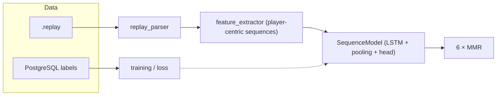

# Is this a smurf?

Upload a Rocket League replay and get per-player **rank** estimates from a trained model. The app highlights players who look **strong for the lobby** so you can spot smurf-style outliers.

This repository contains the **WASM web app** (`is_this_a_smurf`), the **ML pipeline** (`rocket_league_score`, `ml_model`), **replay ingestion** (`ballchasing_downloader`), and a **PostgreSQL** schema (`database`) used for training data.

### ML architecture (high level)

Training and inference follow the same idea: **parse** a replay into frames, **extract player-centric features** (each of the six lobby slots gets its own sequence centered on that car), and run a **Burn** neural net that outputs **one MMR estimate per player**. Labels come from stored player ratings (MMR) in the database. The player-centric setup lets the model assign **different** skill estimates to teammates and opponents in the same match, which is what powers **strong-for-lobby** highlighting.



Inside **SequenceModel**, each player’s frame sequence passes through a **stack of LSTMs**, then **temporal pooling** (last timestep plus mean over the segment), then a **shared** per-player MLP head so all six slots use the same weights but stay **independent** (no mixing predictions across players in the forward pass).

---

## Full reproduction pipeline

These steps rebuild the data, training, and web app from a developer environment.

### 1. Install: Open the dev container

1. Install [Docker](https://docs.docker.com/get-docker/) and the [Dev Containers](https://marketplace.visualstudio.com/items?itemName=ms-vscode-remote.remote-containers) extension (or use Cursor’s equivalent).
2. Clone this repository and open the folder in the editor.
3. Run **Dev Containers: Reopen in Container** (or **Reopen in Container**).

### 2. Restore the database from the shipped dump

```bash
cd /workspace
cargo make restore-database
```

### 3. Download replays from Ballchasing

Set `DATABASE_URL` and a **Ballchasing API key** (see `crates/config` — `BALLCHASING_API_KEY`). 

```bash
cd /workspace
export BALLCHASING_API_KEY="your-api-key"

cargo run -p ballchasing_downloader
```

The binary runs migrations, synchronizes `download_status` with replay files under your replay base directory (same rules as `verify_downloaded_replays`), then starts the downloader loop.

### 4. Run the training pipeline (release)

This is the long step: full training against the database, potentially **many days**.

```bash
cargo run --release -p rocket_league_score --example pipeline
```

The example writes a log file under `models/` relative to your **current working directory** (for example `models/` at the repo root if you ran the command from `/workspace`).

**GPU:** For practical speed, run this **outside** the devcontainer on a host with a suitable GPU (and the same `DATABASE_URL` reachable from that host). The devcontainer is fine for development but training benefits from native GPU acceleration (e.g. Burn / WGPU).

### 5. Copy the new model into `data/`

Training produces checkpoint and config artifacts. Copy the **binary checkpoint** and **JSON config** you want to ship into the **repo root** `data/` directory using a versioned pair, for example:

- `data/v9.mpk`
- `data/v9.config.json`

Then point the web app at them by editing `crates/is_this_a_smurf/src/embedded_model.rs`:

- `include_bytes!(...)` → `data/v9.mpk`
- `include_str!(...)` → `data/v9.config.json`

Rebuild the WASM app after changing versions.

### 6. Start the “Is this a smurf?” website

From the **workspace root** (requires `cargo-make`, installed in the devcontainer via `cargo-binstall`):

```bash
cd /workspace
cargo make start-web
```

This runs Dioxus (`dx serve`) and the Tailwind watcher in parallel for `crates/is_this_a_smurf`. Open the URL printed in the terminal (typically a local host/port).

---

## License

This repository is free, open source and permissively licensed. All code is dual-licensed under either:

- MIT License (`LICENSE-MIT` or https://opensource.org/licenses/MIT)
- Apache License, Version 2.0 (`LICENSE-APACHE` or https://www.apache.org/licenses/LICENSE-2.0)

at your option.

## Contributions

Unless you explicitly state otherwise, any contribution intentionally submitted for inclusion in the work by you, as defined in the Apache-2.0 license, shall be dual licensed as above, without any additional terms or conditions.
