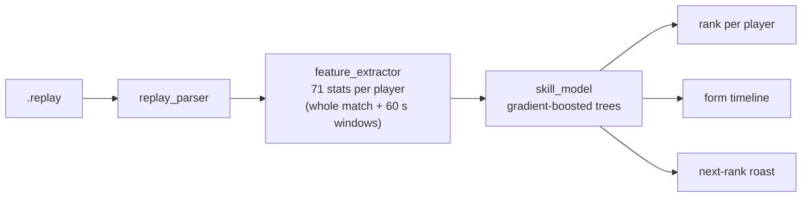

# Is this a smurf?

Upload a Rocket League replay and get a **rank estimate for every player**, a one-minute
**form timeline**, and a **roast** about what the next rank up does better. Players who look
much stronger than their lobby get the smurf badge.

This repository contains the **WASM web app** (`is_this_a_smurf`), the **skill model** it
embeds (`skill_model`) and its **training** (`skill_model_training`), **replay parsing and
stats** (`replay_parser`, `feature_extractor`), **replay ingestion** (`ballchasing_downloader`)
and the **PostgreSQL** schema (`database`) that holds the training labels.

### How it works


```mermaid
flowchart LR
  R[".replay"] --> P["replay_parser"]
  P --> S["feature_extractor<br/>71 stats per player<br/>(whole match + 60 s windows)"]
  S --> M["skill_model<br/>gradient-boosted trees"]
  M --> C["rank per player"]
  M --> T["form timeline"]
  M --> Q["next-rank roast"]
```

Each player's game is summarised in plain stats (movement, boost, positioning, ball control,
mechanics from controller inputs, scoreboard…). Gradient-boosted trees trained on ~27k ranked
3v3 replays turn them into a lobby level plus each player's gap to the lobby. Accuracy on
held-out replays: ~106 MMR per player, ~95 MMR per lobby. Details, metrics and history:
[`docs/model.md`](docs/model.md).

---

## Full reproduction pipeline

These steps rebuild the data, the model, and the web app from a developer environment.

### 1. Install: Open the dev container

1. Install [Docker](https://docs.docker.com/get-docker/) and the [Dev Containers](https://marketplace.visualstudio.com/items?itemName=ms-vscode-remote.remote-containers) extension (or use Cursor’s equivalent).
2. Clone this repository and open the folder in the editor.
3. Run **Dev Containers: Reopen in Container** (or **Reopen in Container**).

### 2. Restore the database from the shipped dump

```bash
cd /workspace
cargo make restore-database
```

### 3. Download replays from Ballchasing

Set `DATABASE_URL` and a **Ballchasing API key** (see `crates/config` — `BALLCHASING_API_KEY`).

```bash
cd /workspace
export BALLCHASING_API_KEY="your-api-key"

cargo run -p ballchasing_downloader
```

The binary runs migrations, synchronizes `download_status` with replay files under your replay
base directory (same rules as the `verify_downloaded_replays` binary), then starts the
downloader loop.

### 4. Train the model

```bash
cargo run --release -p skill_model_training --bin extract_stats   # ~5 min, CPU
cargo run --release -p skill_model_training --bin train            # ~15 min, CPU
```

`train` prints the evaluation, writes `data/skill_model.bin` and checks it reloads to identical
predictions. The app embeds that file directly; rebuild the app after retraining. No GPU needed.

### 5. Start the “Is this a smurf?” website
From the **workspace root** (requires `cargo-make`, installed in the devcontainer via `cargo-binstall`):

```bash
cd /workspace
cargo make start-web
```

This runs Dioxus (`dx serve`) and the Tailwind watcher in parallel for `crates/is_this_a_smurf`. Open the URL printed in the terminal (typically a local host/port).

---

## License

This repository is free, open source and permissively licensed. All code is dual-licensed under either:

- MIT License (`LICENSE-MIT` or https://opensource.org/licenses/MIT)
- Apache License, Version 2.0 (`LICENSE-APACHE` or https://www.apache.org/licenses/LICENSE-2.0)

at your option.

## Contributions

Unless you explicitly state otherwise, any contribution intentionally submitted for inclusion in the work by you, as defined in the Apache-2.0 license, shall be dual licensed as above, without any additional terms or conditions.
